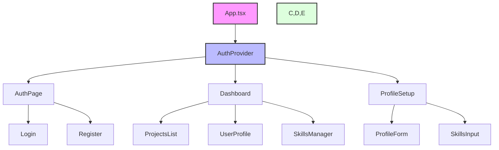
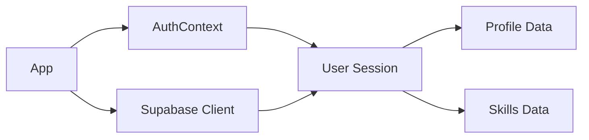

# CampusCollab Documentation

## Table of Contents

1. [Project Overview](#project-overview)
2. [Component Architecture](#component-architecture)
3. [API Documentation](#api-documentation)
4. [Tech Stack](#tech-stack)

## Project Overview

CampusCollab is a web application that facilitates collaboration between students by matching skills and learning interests. Users can create profiles, list their skills, indicate what they want to learn, and connect with others for projects and skill sharing.

## Tech Stack

- Frontend: React + TypeScript + Vite
- Styling: TailwindCSS
- Backend: Supabase (PostgreSQL + Authentication)
- Package Manager: npm

## Project Structure

### Core Directories

```
campuscollab-main/
├── src/                    # Source code
│   ├── components/         # React components
│   │   ├── Auth/          # Authentication components
│   │   ├── Profile/       # Profile management
│   │   └── Dashboard/     # Main app dashboard
│   ├── contexts/          # React contexts (auth, etc.)
│   ├── lib/               # Shared utilities and config
│   └── main.tsx           # App entry point
├── supabase/              # Database migrations and config
└── public/                # Static assets
```

## Database Schema

### Tables

#### profiles

Primary user information storage
\`\`\`sql
CREATE TABLE profiles (
id uuid PRIMARY KEY REFERENCES auth.users(id),
full_name text NOT NULL,
department text NOT NULL,
year text NOT NULL,
bio text DEFAULT '',
created_at timestamptz DEFAULT now(),
updated_at timestamptz DEFAULT now()
);
\`\`\`

#### skills

User skills (both have and want to learn)
\`\`\`sql
CREATE TABLE skills (
id uuid PRIMARY KEY DEFAULT gen_random_uuid(),
user_id uuid REFERENCES profiles(id),
skill_name text NOT NULL,
skill_type text CHECK (skill_type IN ('have', 'want')),
created_at timestamptz DEFAULT now()
);
\`\`\`

## Authentication Flow

1. User arrives at app → sees AuthPage component
2. Two paths:
   - Login: Existing users enter credentials
   - Register: New users create account
3. After authentication:
   - App checks for existing profile
   - If no profile → ProfileSetup form
   - If profile exists → Dashboard

## Key Components

### AuthPage (`src/components/Auth/AuthPage.tsx`)

- Landing page for unauthenticated users
- Toggles between Login and Register forms
- Handles user authentication state

### ProfileSetup (`src/components/Profile/ProfileSetup.tsx`)

- New user onboarding
- Collects:
  - Full name
  - Department
  - Year
  - Bio (optional)
  - Skills (have/want)
- Creates profile in database

### Dashboard (`src/components/Dashboard/Dashboard.tsx`)

- Main application interface
- Shows after successful auth and profile creation

## State Management

### AuthContext (`src/contexts/AuthContext.tsx`)

Manages authentication state throughout the app

- Provides:
  - user: Current authenticated user
  - loading: Auth state loading status
  - signUp: User registration
  - signIn: User authentication
  - signOut: Session termination

## Database Security

### Row Level Security (RLS) Policies

#### Profiles Table

\`\`\`sql
-- Anyone can view profiles
CREATE POLICY "Anyone can view profiles"
ON profiles FOR SELECT
TO authenticated
USING (true);

-- Users can only insert/update their own profile
CREATE POLICY "Users can insert own profile"
ON profiles FOR INSERT
TO authenticated
WITH CHECK (auth.uid() = id);

CREATE POLICY "Users can update own profile"
ON profiles FOR UPDATE
TO authenticated
USING (auth.uid() = id)
WITH CHECK (auth.uid() = id);
\`\`\`

#### Skills Table

\`\`\`sql
-- Anyone can view skills
CREATE POLICY "Anyone can view skills"
ON skills FOR SELECT
TO authenticated
USING (true);

-- Users can manage their own skills
CREATE POLICY "Users can manage own skills"
ON skills FOR ALL
TO authenticated
USING (auth.uid() = user_id);
\`\`\`

## Environment Configuration

Required environment variables (`/.env.local`):
\`\`\`bash
VITE_SUPABASE_URL=https://your-project.supabase.co
VITE_SUPABASE_ANON_KEY=your-anon-key
\`\`\`

## Development Setup

1. Clone the repository
2. Install dependencies:
   \`\`\`bash
   npm install
   \`\`\`
3. Create `.env.local` with Supabase credentials
4. Start development server:
   \`\`\`bash
   npm run dev
   \`\`\`

## Database Setup

1. Create Supabase project
2. Run migrations from `supabase/migrations/`
3. Verify RLS policies are active
4. Test connection with provided credentials

## Component Architecture



### Component Hierarchy

```
App
├── AuthProvider
│   ├── AuthPage
│   │   ├── Login
│   │   └── Register
│   ├── Dashboard
│   │   ├── ProjectsList
│   │   ├── UserProfile
│   │   └── SkillsManager
│   └── ProfileSetup
│       ├── ProfileForm
│       └── SkillsInput
```

### Component Dependencies



## API Documentation

For detailed API documentation, including all endpoints, types, and examples, see [API.md](./API.md).

### Quick API Reference

#### Authentication

\`\`\`typescript
// Sign Up
const { data, error } = await supabase.auth.signUp({
email: string,
password: string
});

// Sign In
const { data, error } = await supabase.auth.signInWithPassword({
email: string,
password: string
});

// Sign Out
const { error } = await supabase.auth.signOut();
\`\`\`

#### Profiles

1. Create Profile
   \`\`\`typescript
   const { data, error } = await supabase
   .from('profiles')
   .insert({
   id: user.id,
   full_name: string,
   department: string,
   year: string,
   bio: string
   })
   .select();
   \`\`\`

2. Get Profile
   \`\`\`typescript
   const { data, error } = await supabase
   .from('profiles')
   .select('\*')
   .eq('id', user.id)
   .single();
   \`\`\`

3. Update Profile
   \`\`\`typescript
   const { data, error } = await supabase
   .from('profiles')
   .update({
   full_name: string,
   department: string,
   year: string,
   bio: string
   })
   .eq('id', user.id)
   .select();
   \`\`\`

#### Skills

1. Add Skills
   \`\`\`typescript
   const { data, error } = await supabase
   .from('skills')
   .insert([
   {
   user_id: user.id,
   skill_name: string,
   skill_type: 'have' | 'want'
   }
   ])
   .select();
   \`\`\`

2. Get User Skills
   \`\`\`typescript
   const { data, error } = await supabase
   .from('skills')
   .select('\*')
   .eq('user_id', user.id);
   \`\`\`

3. Delete Skill
   \`\`\`typescript
   const { error } = await supabase
   .from('skills')
   .delete()
   .eq('id', skillId);
   \`\`\`

### Response Types

\`\`\`typescript
interface Profile {
id: string;
full_name: string;
department: string;
year: string;
bio: string;
created_at: string;
updated_at: string;
}

interface Skill {
id: string;
user_id: string;
skill_name: string;
skill_type: 'have' | 'want';
created_at: string;
}

interface AuthResponse {
user: User | null;
session: Session | null;
error: Error | null;
}

interface DatabaseResponse<T> {
data: T | null;
error: Error | null;
}
\`\`\`

### Error Handling

All API calls should be wrapped in try-catch blocks:

\`\`\`typescript
try {
const { data, error } = await supabase.from('profiles').select('\*');
if (error) throw error;
// Handle success
} catch (error) {
// Handle error based on error.code
console.error('Error:', error.message);
}
\`\`\`

Common Error Codes:

- PGRST116: Record not found
- 401: Unauthorized
- 403: Forbidden (RLS policy violation)
- 409: Conflict (unique constraint violation)

### Real-time Subscriptions

Subscribe to profile changes:
\`\`\`typescript
const subscription = supabase
.channel('public:profiles')
.on('postgres_changes',
{ event: '\*', schema: 'public', table: 'profiles' },
(payload) => {
// Handle change
}
)
.subscribe();
\`\`\`

## Build and Deployment

1. Build the application:
   \`\`\`bash
   npm run build
   \`\`\`
2. Preview the build:
   \`\`\`bash
   npm run preview
   \`\`\`

## Security Considerations

1. Authentication:

   - Uses Supabase Auth
   - JWT tokens for session management
   - Secure password handling

2. Database:

   - Row Level Security (RLS) enabled
   - Policies restrict data access
   - Foreign key constraints
   - UUID for primary keys

3. Environment:
   - Sensitive values in `.env.local`
   - Production credentials separate
   - HTTPS enforced in production

## Error Handling

The application includes several layers of error handling:

1. Authentication Errors:

   - Invalid credentials
   - Registration failures
   - Session expiration

2. Profile Operations:

   - Missing required fields
   - Database constraints
   - Concurrent updates

3. Skills Management:
   - Duplicate entries
   - Permission checks
   - Data validation

## Testing

Run tests with:
\`\`\`bash
npm run test # Run unit tests
npm run typecheck # TypeScript checks
npm run lint # ESLint checks
\`\`\`

## Maintenance

### Regular Tasks

1. Update dependencies
2. Check Supabase console for errors
3. Monitor authentication logs
4. Backup database regularly

### Troubleshooting

Common issues and solutions:

1. "Could not find table 'profiles'":

   - Verify database migrations
   - Check Supabase connection
   - Confirm environment variables

2. Authentication issues:

   - Clear browser cache
   - Check JWT expiration
   - Verify Supabase configuration

3. Profile creation fails:
   - Check RLS policies
   - Verify user authentication
   - Confirm required fields

## Contributing

1. Fork the repository
2. Create feature branch
3. Follow code style guide
4. Submit pull request

## License

This project is private and confidential. All rights reserved.
